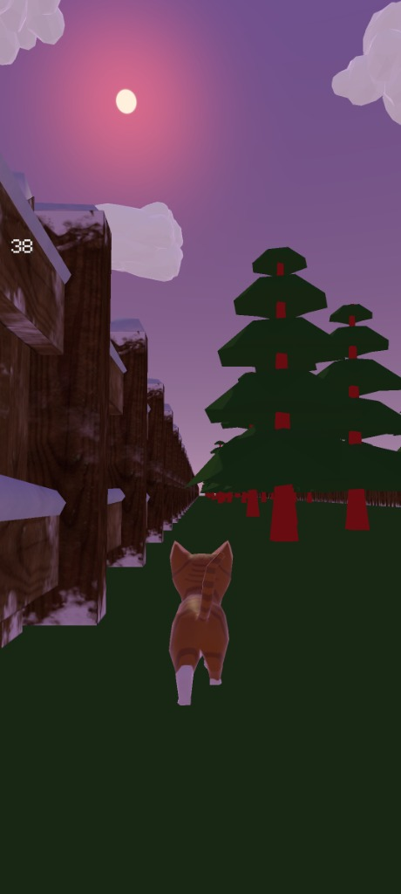

# Catters 🐱

**Catters** is a Unity 3D game project. The repository is structured as a standard Unity project at the root level, making it easy to open, edit, and replicate directly in Unity.

---

## 🎮 Download & Play

- **Latest APK Release**: You can download the latest pre-compiled APK directly from the [GitHub Releases](https://github.com/gaminization/Catters/releases) page.
- **Direct Link**: Download `catters.apk` from [Releases](https://github.com/gaminization/Catters/releases/tag/v1.0.0).

---

## 📸 Gameplay Screenshot

<p align="center">
  
</p>

*Original APK running on Android – a cat races through a snowy corridor avoiding red obstacles.*

---

## 🚀 Opening in Unity

To open and work on the project in Unity Editor:

1. **Prerequisites**:
   - Unity 2021.3 LTS (or recommended compatible Unity Hub version).
   - Android Build Support module enabled (if building APK).

2. **Open Project**:
   - Open **Unity Hub**.
   - Click **Add** -> **Add project from disk**.
   - Select the root directory of this repository (`Catters`).
   - Click **Open**.

3. **Project Layout**:
   ```text
   Catters/
   ├── Assets/              # Unity project source files, scripts, scenes, models
   ├── Packages/            # Unity package configuration (manifest.json)
   ├── ProjectSettings/     # Unity project settings
   ├── recovery/            # Recovery tools, extracted APK data, and extra artifacts
   └── README.md            # Project documentation
   ```

---

## 🛠️ Recovery Artifacts (`recovery/`)

The [`recovery/`](file:///home/gaminizer/Projects/cattersrecovery/recovery) directory contains additional tools, extracted APK data, and recovery resources used to reconstruct the project:

- **`catters.apk`**: Backup copy of the recovered Android application package.
- **`extracted_apk/`**: Unpacked APK assets and resources.
- **`recoverytool/`**: Scripts and utilities used during project recovery.
- **`Applications/`**: Auxiliary tools and decompiler executables.
- **`cattersrecovered/`**: Intermediate extraction outputs and AssetRipper / AssetStudio logs.

---

## 📄 License

This repository is licensed under the [MIT License](LICENSE).