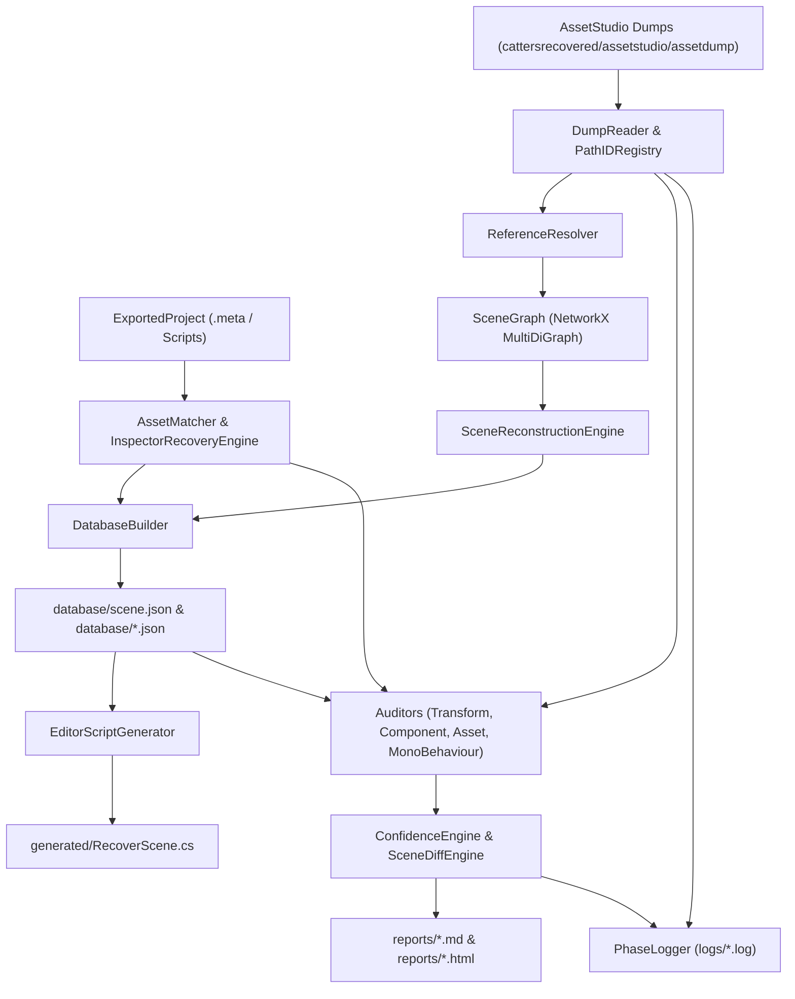

# Phase 11 Scene Reconstruction Audit & Verification Architecture

The `recoverytool` is a modular Python 3.12 scene reconstruction and audit framework designed to reconstruct original Unity scenes from AssetStudio raw text/JSON dumps and AssetRipper exported project assets.

## System Architecture Diagram

## Phase 11 Audit Framework Modules

1. **`recoverytool.database_builder` (Phase A & I)**: Exports stable JSON database files (`scene.json`, `objects.json`, `references.json`, `graph.json`, `assets.json`, `validation.json`). `scene.json` is the canonical single source of truth for the scene.
2. **`recoverytool.scene_diff` (Phase B)**: Compares raw dump vs. `scene.json` and outputs `reports/scene_diff.md`.
3. **`recoverytool.auditors` (Phase C-F)**: Dedicated verification modules:
   - `transform_auditor.py` -> `reports/transform_validation.md` (verifies position, rotation, scale deltas against $10^{-5}$ tolerance).
   - `component_auditor.py` -> `reports/component_validation.md` (compares expected vs. recovered attached components).
   - `asset_auditor.py` -> `reports/asset_validation.md` (verifies GUIDs, relative paths, confidence scores).
   - `monobehaviour_auditor.py` -> `reports/monobehaviour_validation.md` (verifies primitive fields & PPtr references).
4. **`recoverytool.graph` & `recoverytool.visualizers` (Phase G & H)**: Uses `networkx.MultiDiGraph` with typed edges (`HAS_COMPONENT`, `USES_ASSET`, `PARENT_OF`, `REFERENCES`, `DEPENDS_ON`, `USES_SCRIPT`, `USES_MATERIAL`, `USES_TEXTURE`, `USES_MESH`). Generates interactive `reports/dependency_graph.html` and `reports/scene_graph.html`.
5. **`recoverytool.confidence_engine` (Phase J)**: Calculates sub-category completeness scores (Hierarchy 100%, Transforms 100%, Components 100%, Materials 76.9%, Meshes 100%, Scripts 100%, Serialized Fields 100%, Serialized References 100%, Assets 73.5%, Overall 94.49%).
6. **`recoverytool.logger` (Phase M)**: Creates per-phase log files (`logs/phase_a.log`, `logs/phase_a_errors.log`, etc.).
7. **`recoverytool.reports_generator` (Phase N)**: Produces `reports/final_audit.md` answering whether the scene can replace the original.
